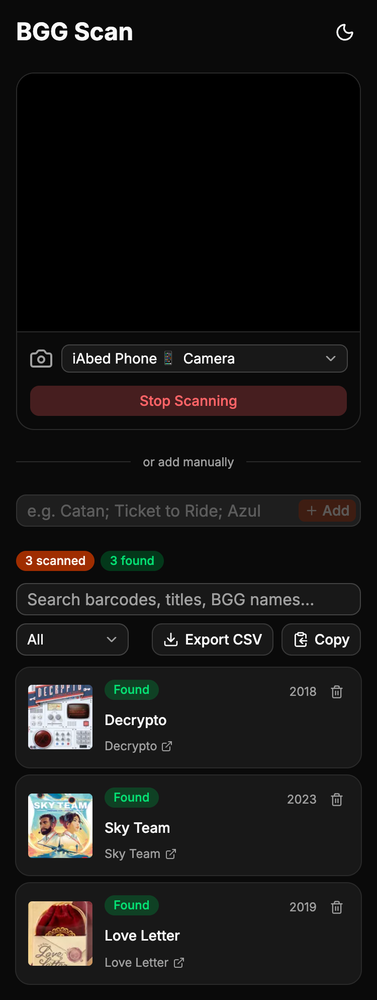
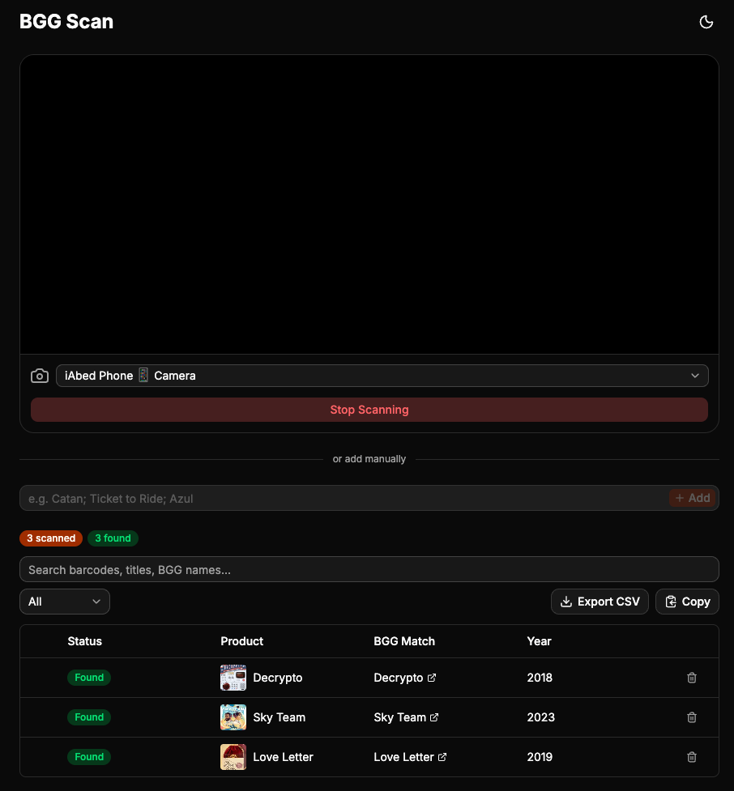

# BGG Scan

Scan board game barcodes with your phone camera and identify them on [BoardGameGeek](https://boardgamegeek.com).

<div align="center">
  
  
</div>

## How It Works

1. Open the app on your phone and tap **Start Scanning**
2. Point your camera at a board game barcode
3. The app looks up the barcode, finds the game on BGG, and adds it to your list
4. If multiple matches are found, pick the right one from the options shown
5. Keep scanning as many games as you want
6. Export your list as CSV or copy to clipboard

## Adding to Your BGG Collection

After scanning, export your list as CSV or copy it to clipboard, then use [bgg-collection-updater](https://github.com/aabuhijleh/bgg-collection-updater) to bulk-add the games to your BoardGameGeek collection.

## Setup

```bash
bun install
cp .env.example .env
bun start
```

Add your BGG XML API bearer token to `.env` — get one at [boardgamegeek.com/applications](https://boardgamegeek.com/applications). Optionally add a UPC Item DB API key for higher rate limits.

Open `http://localhost:8000`. To access from your phone, run `bun run tunnel` to get a public Cloudflared URL.

## Deploy

```bash
bun run deploy
```

Deploys to Cloudflare Workers. Set the required secret with `wrangler secret put BGG_XML_API_BEARER_TOKEN`. Optionally set `wrangler secret put UPC_ITEM_DB_API_KEY` for the paid UPC API tier.

## Related

**[BGG Collection Updater](https://github.com/aabuhijleh/bgg-collection-updater)** -- Bulk-add board games to your BoardGameGeek collection. Search games by name to find their BGG IDs, or paste IDs directly, then add them all to your collection in one go. Runs locally on your machine using browser automation. Pair it with this app: scan barcodes here, then paste the matched BGG IDs into the updater to add them to your collection.
